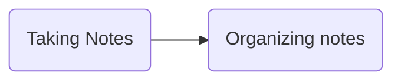

Obsidian is a pretty stellar note-taking application. It's supports pretty much every Markdown feature you might expect, is free-to-use, heavily customizeable and extensible with an active contributor community, and lives on the user local filesystem.

Obsidian does a lot of things right. A flexible Markdown application can be pretty handy, but a bit overwhelming to set up. I've been an Obsidian user for about a year, and have heavily customized it to suit my own needs for journaling, note-taking, and more. 

This year, I left my job to go full time on building [Uncloak](https://uncloak.org), a community-wiki primarily focusing on cryptography engineering and zero knowledge cryptography. I'm aiming to make cryptography education accessible to everyone by taking advantage of Obsidian's features, in particular, the interactive Obsidian graph.

While Uncloak is built with Obsidian, every page is pure Markdown; you don't have to follow this post (or perhaps series of posts) to contribute. But I want to recommend Obsidian as a tool, for those who would like to use it. This post is aimed at those who are interested in getting started with Obsidian. 

We'll go over Obsidian in three parts. In Part One, we'll set up some sane defaults and name a few useful plugins. I've set up a sample Obsidian directory to go along with this post, containing most of the setup choices I describe here. You may [clone it](https://github.com/thor314/obsidian-setup) to try it out. If you'd like to steal some or all of the settings, copy the `.obsidian*` folder.

In Part Two, we'll talk about how to use Obsidian for a few different workflows: knowledge-basing, journaling, and self-organization, and how to best set Obsidian up for your purposes.

Finally, in Part Three, I'll describe every plugin I've looked at in the last year, and how you might use them. I've looked at a lot. In preparation for this post, I looked at a lot more. 

If you're just getting started with Obsidian, I don't recommend you try reading this post in one sitting. You may want to take several passes over each section, while you set up Obsidian the way you like it.

For questions, feel free to [message me on Twitter](https://twitter.com/cryptograthor), shoot me an email at thorck a-squiggle pm dot me, or try the [Obsidian User Forum](https://forum.obsidian.md/).

## Part One 
### installin stuff
[Go to the install page](https://obsidian.md/download) or copy the instructions below:
```sh
# Getting Started with Obsidian
brew install --cask obsidian
# Linux; I recommend the snap installation.
# dangerous/classic means the application doesn't run in a sandbox, you may exclude them if you like.
# from my setup script: https://github.com/thor314/.setup/blob/main/install.sh#L189

# Change 1.0.3 to the current versoin
wget https://github.com/obsidianmd/obsidian-releases/releases/download/v1.0.3/obsidian_1.0.3_amd64.snap
snap install --dangerous --classic obsidian_*.snap
```

### Getting started
Open the app, and make a directory, as directed by the GUI. Note that you can manipulate files via the terminal as well. Make a new file, and play with the buttons on the left sidebar. The most useful hotkeys are is **Ctrl-P**, bringing up the Command Palette and **Ctrl-,** for settings. 

After a quick walk through some convenient settings options, we'll walk through some workflows to make the most of Obsidian.

 I won't go through every setting, just a few important ones. Where relevant, I will link to community plugins I recommend. On your first read through, I might recommend skipping the plugin links until a second pass, as it's easy to spend an hour rabbitholing on a plugin. I also list all my plugins recommendations and how to set them up at the bottom of this article.

#### Some Sane Defaults
- Editor:
  - spellcheck, when working on a page I intend to publish (ie. Uncloak)
  - 2-space indents, for nicely laid out lists (like this one)
  - vim mode - configurable via the [vimrc](obsidian://show-plugin?id=obsidian-vimrc-support) plugin, which we will return to shortly;
- Files and Links:
  - Move deleted files to Obsidian `.trash` folder instead of deleting, makes for easy recovery
  - Automatically update internal links - Obsidian can track links between files, and update links when you change title names.
  - Default location for new attachments set to *In the folder specified below: `media`*; storing all media in one location is convenient for avoiding clutter in your directories. You may want to exclude your media folder from searches.
- Appearance:
  - Minimal is a popular theme with a [plugin to tweak](obsidian://show-plugin?id=obsidian-minimal-settings) elements of the appearance, like coloring headers differently. I find that the Atom and Catpuccin theme tweaks in the prior plugin make Obsidian feel warmer. [Hider](https://obsidian.md/plugins?id=obsidian-hider) is also useful for hiding unwanted UI elements.
  - The native fonts are good, but I like custom fonts. I use [Fira Code](https://github.com/tonsky/FiraCode) for a monospace font, and I use [Karla](https://fonts.google.com/specimen/Karla) and [Atkinson](https://brailleinstitute.org/freefont) for system and text fonts. If you want to font-dive, check out [nerdfonts](https://www.nerdfonts.com/). You may have to log out and log back in before Obsidian recognizes your fonts.[^1]
- Hotkeys - There's a lot to unpack here, but the default keybinds are basically okay. You can look at [hotkey plugins](https://obsidian.md/plugins?search=hotkeys) if you'd like; [Hotkeys++](obsidian://show-plugin?id=hotkeysplus-obsidian) is quite good. I'm a fan of [Chorded keys](obsidian://show-plugin?id=leader-hotkeys-obsidian) for grouping related keybinds, which helps with remembering where I bound a key.

#### Core Plugins
  We'll run through the plugins Obsidian ships with. Some are good, others are outclassed by existing community plugins. 
  - Audio recorder - record audio and save in a note; not used
  - Backlinks - show what other notes link to this note; great for knowledge-graphing
  - Command Palette - Good. 
  - Daily Notes - if you intend to journal, Daily Notes is outclassed by [Periodic Notes](obsidian://show-plugin?id=periodic-notes) for journaling and regular (weekly/monthly/quarterly/yearly) reviews.
  - File Explorer - I go back and forth between this and [File Tree](obsidian://show-plugin?id=file-tree-alternative). File Tree is more compact and less finicky; I tend to like File Tree more, but both are good.
  - File recovery - Great file backup, takes snapshots of the vault every N minutes.
  - Format converter - for migrating from another app.
  - Graph View - if using Obsidian for knowledge-basing, Graph view is great! There are several adjacent plugins, we'll get to those later.
  - Note composer - I would rather just copy paste than have hotkeys to break notes into parts. There's a popular community plugin to power this feature up called [Note Refactor](obsidian://show-plugin?id=note-refactor-obsidian), but I don't use it.
  - Outgoing links - Show the outgoing links from the open file in the right sidebar. I don't use it often. 
  - Outline - See the outline of a long note in the right sidebar, seldom used
  - Page preview - hover a link to see the first few lines, wikipedia style. Great feature.
  - Publish - premium feature, a bit pricey, but great if you'd like to work on a [public knowledge graph to share with your community](https://uncloak.org) 
  - Quick Switcher - outclassed; I use [quick switcher++](obsidian://show-plugin?id=darlal-switcher-plus) to search for notes, subheadings and more.
  - Random note - never used
  - Search - good. [Omnisearch](obsidian://show-plugin?id=omnisearch) is a search power-up.
  - Slash - just use command palette
  - Slides - never used, but hypothetically for making presentations from markdown.
  - Starred - nice in theory, in practice I prefer to set hotkeys with [Hotkeys for specific files](obsidian://show-plugin?id=obsidian-hotkeys-for-specific-files) for my most used files.
  - Sync - premium feature for $100/year to sync files across devices; there are community plugins if you'd like to avoid the fee and sync via dropbox or git repos. 
  - Tags - tag files with \#hashtags, as a way to categorize files. Hashtags work with forward slashes for organization, so \#supercategory/category/subcategory creates a nested series of tags. Disabling the tags plugin doesn't disable tags, only the right-sidebar tags interface. Plays nicelywith the [Tag Wrangler](obsidian://show-plugin?id=tag-wrangler), which adds tools to manage tags.
  - Templates - create notes from templates. [Templater](obsidian://show-plugin?id=templater-obsidian) is the powered up version of Templates.
  - Unique note creator - Create random hashes for note prefixes. Never used.
  - Word count - Show the word count at the bottom, nice to have. [Better word count](obsidian://show-plugin?id=better-word-count) eclipses by updating the word count when you select a section of text.
  - Workspaces - Open a specific set of pages. Useful for systemically returning to a set of notes. [Workspaces Plus](obsidian://show-plugin?id=workspaces-plus) enhances the workspace workflow.

## Workflows
So hopefully that quick run through settings-land wasn't too excruciatingly dull; we're going to switch gears into some ways you might like to use the app. As it goes with productivity tools and cults, some things are straightforward, others are not--the jutting darkly faceted tablet emerging from yonder void probably means nothing, must mean nothing, and must never be spoken of.

Carrying on, we're going to focus on some common workflows for the app. If you haven't yet, play around with the Obsidian interface for a little while before diving into workflows. 
We'll focus on outfitting Obsidian for three workflows:
- Knowledge base-ing
- Journaling
- Self organization

### Based Knowledge is Based
The basic premise of choosing to use a graph-based knowledge base is that the connections that arise from the graph context can be quite useful. Obsidian doesn't force you to use the tool in any one way, but a particularly good way is based on the [Zettelkasten](https://en.wikipedia.org/wiki/Zettelkasten) approach. There's now an abundance of zettelkasten guides; they basically all boil down to a few key points:
- Set up your knowledge base like a gardener: the reward of doing the whole knowledge base thing is that you get to spend your time wandering around it. Take notes however feels rewarding, but the reason we use a graph at all is to make the connections between concepts clear.
- Develop your own system for how you want to organize and categorize notes. I'll recommend a system below, but developing a sense for the *types* of ideas can be quite powerful in itself. Tags (\#these_things) are my preferred way to categorize types of ideas.
- When describing concepts, shorter notes that state *exactly the point*, are better suited for the graph garden than long-winding notes. Short notes describing single concepts make clearer connections.
- When exploring a new idea, it may be worthwhile to have a staging area for taking notes (eg. when reading a book), and a graphing area for moving finished staged notes into. This takes time, and may not be worthwhile for topics you don't much care about.

I've wandered around the Zettelkasten buzzword thought leadership; my recommendation is don't bother. Knowledge can be complicated, but the system is simple. Invest extra time in note-organizing for the reward of a contextually clear knowledge graph. Develop ideas about how your ideas fit together, their typology. Shorter notes make for more elegant node elements. Don't knowledge graph topics you don't care about. 

A possible workflow might look like this:
- Make a top-level directory for each use case you intend to use Obsidan for. In this case, I might recommend one for note taking, and one for knowledge-basing. If you want different settings for different directories, use separate Obsidian Vaults. Eg. I want spell and [grammar checks](https://obsidian.md/plugins?id=obsidian-languagetool-plugin) on when I work on the [Uncloak Cryptography knowledge base](https://uncloak.org), but not always.
- Take notes however you'd like. I keep a directory for notes on books, papers, and blog posts each. There are integrations with Zotero and Readwise that I'm trying out, I'll update this later if I think either is any good. 

todo: more
### Journaling
todo
### Self organization
todo

## All the plugins
There's no turning back. You made it 2000+ words into a post about a notes app. You've committed to the lifestyle. The purple monolith is your friend. The purple monolith wants to make you happy. You want to make the purple monolith happy. There are no notes app cultists looking for you. You probably want to extend the purple monolith with nice plugins. Here's my notes on some nice plugins, and how to fix some user-experience paper cuts.

Keybinding aside: After having poured vastly too much time into poking my keybinds in other apps, I now like to generally keep my keybind setups minimally divergent from the defaults where possible. I remap caps lock to control for convenience. If you're on a small keyboard that combines fn keys with f-keys, I might suggest switching your fn keys to default to f-keys, and use your fn button to enable the special volume/brightness buttons. I like to group similar commands under Leader-key keybind chords, eg. `Ctrl-Space f a`, where `Ctrl-Space` is the "leader key". Eg I group special Advanced Table commands under `Ctrl-Space t`. Leader keys also have the convenience of never colliding with keybindings from other applications. 

There are three leader key plugins, and unfortunately they all have minor bugs; the least buggy is [Leader Hotkeys Obsidian](obsidian://show-plugin?id=leader-hotkeys-obsidian). If you don't use vim mode[^2], it's not buggy at all, but the hotkeys currently [don't work in vim normal-mode](https://github.com/tgrosinger/leader-hotkeys-obsidian/issues/32).. You can also use the vimrc to set leader key combinations, but the overhead of declaring `obcommand` for everything is a bit much for me (see the vimrc for an example).

The following plugin list documents the list of plugins I've tried, am trying, or have noped out of. This setup
- [[#General low setup|General low setup]]
- [[#General medium setup|General medium setup]]
- [[#General high setup|General high setup]]
- [[#Organization Plugins|Organization Plugins]]
- [[#Knowledge Basing Plugins|Knowledge Basing Plugins]]
- [[#Journaling Plugins|Journaling Plugins]]
- [[#Integrations with apps you may use|Integrations with apps you may use]]
- [[#Plugins I should mention but don't use|Plugins I should mention but don't use]]

### General low setup
Plugins that just work, with 5 minutes of setup or less:
- [Advanced New File](obsidian://show-plugin?id=obsidian-advanced-new-file) - Create new files, prompts for what directory to put the file in, so you don't have to move them manually. I replace the default *new note* Ctrl-N with this. The Advanced New Folder plugin is broken, unfortunately.
- [Advanced Tables](obsidian://show-plugin?id=obsidian-advanced-new-file) - Must have, makes working with Markdown tables easy. I set table hotkeys under a leader key to make them easier to remember, but the setup of the actual plugin is very minimal.
- [Auto Link Title](obsidian://show-plugin?id=obsidian-auto-link-title) - No setup, replace pasting links with their title.
- [Better word count](obsidian://show-plugin?id=better-word-count) - Extends the bottom ribbon to update when selecting text.
- [Clear Unused Images](obsidian://show-plugin?id=oz-clear-unused-images) - Finds unused images in your media folder and clears them, saving space in your vault.
- [Creases](obsidian://show-plugin?id=creases) - Not a huge improvement, but gives hotkeys for folding by headers, and a custom folding scheme that I don't ever use. I bind the default toggle-fold to Alt-H, and some of the toggle-fold for H1-6 to leader-keys.
- [Filename Heading Sync](obsidian://show-plugin?id=obsidian-filename-heading-sync) - H1 headers should usually match filenames. This plugin enforces it.
- [Footnote Shortcut](obsidian://show-plugin?id=obsidian-footnotes) - 1 new hotkey for creating, jumping to, and jumping back from footnotes, which I bind to Alt-F. I tried [Better Footnote](obsidian://show-plugin?id=better-fn), but found its model of footnotes less convenient.
- [File Tree Alternative](obsidian://show-plugin?id=file-tree-alternative) - alternative to the default file-explorer. Shows files in a more compact way, with note counts. Doesn't require much setup; you will know quickly whether you like or hate the UI.
- [Hider](obsidian://show-plugin?id=obsidian-hider) - Hide UI elements you don't like. I hide the app ribbon (don't do this unless you're totally comfortable with the keyboard commands!) and the scrollbar.
- [Hotkey Helper](obsidian://show-plugin?id=hotkey-helper) - Tools for managing and viewing plugin hotkeys.
- [Hotkeys++](obsidian://show-plugin?id=hotkeysplus-obsidian) - Some overlap with vim mode. I mainly use this to toggle to-do lists and blockquotes. The default keybinds are fine.
- [Natural Language Dates](obsidian://show-plugin?id=nldates-obsidian) - Trigger Obsidian to replace natural language dates with the character @.
- [Obsidian Charts](obsidian://show-plugin?id=obsidian-charts) - Create charts. Not a lot of setup, the popup on `Insert New Chart`, and `Create Chart from Table` are pretty self-explanatory. I don't use this too often, but it's a nice feature to have.
- [Omnisearch](obsidian://show-plugin?id=omnisearch) - Powered up fuzzy grepping search across files and vaults. Replaces core search plugin, and in-file search. Bind vault-search to Alt-O, runs slower than find-note search, which doesn't search inside files. For another powered-up search with many settings for filtering, see [Vantage](obsidian://show-plugin?id=vantage-obsidian).
- [Obsidian Pandoc](obsidian://show-plugin?id=obsidian-pandoc) - Tool to export notes to other formats: pdf, html, ePub, docx, Latex, etc. Requires that you have `pandoc` and `pdflatex` CLI tools, which you should be able to install with your package manager of choice.
- [Remember Cursor Position](obsidian://show-plugin?id=remember-cursor-position) - Does what it says on the box: remembers cursor position across files.
- [Scroll Offset](obsidian://show-plugin?id=obsidian-scroll-offset) - Keep some distance between your cursor and the bottom of the screen, I set to 80 px, or about 3 lines. If you click into the buffer space, you break the spacing for the current note.
- [Show Current File Path](obsidian://show-plugin?id=obsidian-show-file-path) - Show the file path in the bottom ribbon in an unobtrusive way.
- [Tag Wrangler](obsidian://show-plugin?id=tag-wrangler) - More tools to manage tags in the core plugin right-sidebar tags pane.

### General medium setup
Plugins that you may want to poke for at least 10 minutes:
- [Completr](obsidian://show-plugin?id=obsidian-completr) - YAML frontmatter and LaTeX completions. I disable natural language completions, as I find it more often annoying than helpful.
- [Dictionary](obsidian://show-plugin?id=obsidian-dictionary-plugin) - Create a dictionary view in the right sidebar, includes a thesaurus. Bound to Alt-D. Supports several languages.
- [Minimal Theme Settings](obsidian://show-plugin?id=obsidian-minimal-settings) - Set up Obsidian to look the way you want to. I use the Atom custom theming, enable focus mode, change headers to be of different colors, and disable image maximization.
- [Obsidian Git](obsidian://show-plugin?id=obsidian-git) - Back up your personal vault to a remote git repository every N minutes. I've stopped using this in favor of the premium Sync, but it is well done. It doesn't work with sandboxed Obsidian clients (Linux snap classic installation) though.
- [Quick Switcher++](obsidian://show-plugin?id=darlal-switcher-plus) - Replaces the Quick Switcher default plugin. The default command palette shows key-bindings, so the default is still preferred there. I bind Ctrl-S to `Symbol Mode` and Ctrl-L to `Related Items Mode`, and Ctrl-H to `Headers Mode`, and move `Search Replace` to Ctrl-R.
- Sliding Panes (Andy Matuschak Mode) - Deprecated, but I want to highlight the `Toggle Stacked Tabs` command. If you use many tabs, stacked tabs can be quite powerful. Documentation: [Stacked tabs - Obsidian Help](https://help.obsidian.md/User+interface/Stacked+tabs).
- [Smarter Markdown Hotkeys](obsidian://show-plugin?id=obsidian-smarter-md-hotkeys) - Hotkeys to replace many toggle commands in Obsidian. Smarter assumes that if your cursor is on a word or part of a word, you mean to bold/italic/whatever the whole word, not put asterisks in the mi\*\*\*\*dle of the word like this. I bind many of these, replacing defaults where applicable.

### General high setup
Some plugins are high-investment, high reward, if they fit your use-case. Each of these may take at least a half hour to set up; possibly much more, depending on how much mileage you want out of them.
- [Dataview](obsidian://show-plugin?id=dataview) - A JavaScript API and SQL-like query language for filtering, sorting, and extracting data from your vault. May heavily influence how you use notes' yaml metadata. Suggested use case: you've used Obsidian for awhile, and want to analyze metadata about your vault. If you're using this, you may also want to look at [MetaEdit](obsidian://show-plugin?id=metaedit), for managing note metadata. I don't currently use this.
- [Linter](obsidian://show-plugin?id=obsidian-linter) - Highly flexible tool for correcting common formatting issues. The tool is very conservative by default, but has many options to enable, as well as an option to define custom rules.
- [QuickAdd](obsidian://show-plugin?id=quickadd) - Powerful way to add content to the vault. QA comes with 4 modes:
  - [Template](https://github.com/chhoumann/quickadd/blob/master/docs/Choices/TemplateChoice.md) - Create files from templates. If every note in a directory follows the same template, Templater's folder-template feature is more useful. If notes within a directory may use multiple templates, QA Template is your go-to.
  - [Capture](https://github.com/chhoumann/quickadd/blob/master/docs/Choices/CaptureChoice.md) - Pop up a prompt to append to some named file. For example, if I wanted to create a journal entry in my daily note file with a timestamp and an entry, all without leaving the note I'm currently working from, I could use a QA Capture.
  - [Macro](https://github.com/chhoumann/quickadd/blob/master/docs/Choices/MacroChoice.md) - Call custom JS macros. Requires writing javascript, which I don't much do. 
  - [Multi-choice](https://github.com/chhoumann/quickadd/blob/master/docs/Choices/MultiChoice.md) - if you write many QA's, multichoice allows you to organize them.
- [Templater](obsidian://show-plugin?id=templater-obsidian) - More powerful tools for templating files. The basic tools are already quite powerful. If you're comfortable writing JS scripts, you may embed [your own scripts](https://silentvoid13.github.io/Templater/user-functions/script-user-functions.html) within templates. If you need powerful templates, this is your tool. The tool has an active [discussion forum](https://github.com/SilentVoid13/Templater/discussions).
- [Tracker](obsidian://show-plugin?id=obsidian-tracker) - similar to Dataview, but with a more constrained use case: collecting statistics about your vault. [Some examples](https://github.com/pyrochlore/obsidian-tracker/blob/master/docs/Examples.md). Also see [Vault Statistics](obsidian://show-plugin?id=obsidian-vault-statistics-plugin). I don't currently use either.
- [Vimrc Support](obsidian://show-plugin?id=obsidian-vimrc-support) - If you use Vim mode, you probably want this. See the `.obsidian.vimrc` file for a sample setup, and the [home page](https://github.com/esm7/obsidian-vimrc-support) for info. You'll probably want to enable yank-to-system-clipboard and a couple other things.

### Organization Plugins
- [Hotkeys for Specific Files](obsidian://show-plugin?id=obsidian-hotkeys-for-specific-files) - For your personal notes that you intend to regularly revisit, it may be worth binding hotkeys to them. Works nicely with Leader keys. I prefer this over starring notes. I also bind keys for templates that I edit frequently (periodic note templates).
- [Workspaces Plus](obsidian://show-plugin?id=workspaces-plus) - enhances the default Workspaces plugin with useful UI elements and hotkeys. Workspaces are a good candidate for leader keys.
- [MetaEdit](obsidian://show-plugin?id=metaedit) - Edit the YAML metadata with a customizeable modal window. Can be used to name YAML tags and enumerate their values, with a little set up. I prefer MetaEdit plus Completr over the Metadata Menu plugin, which is more flexible, but feels clunkier in practice.

### Knowledge Basing Plugins
todo: leader bind breadcrumbs, hover, workspaces plus
- [Breadcrumbs](obsidian://show-plugin?id=breadcrumbs) - Set up structured relationships (parent, child, sibling) between notes. [Docs](https://breadcrumbs-wiki.onrender.com/docs/Home). Provides it's own tabular view of relationships, also integrates with Juggl for a graph view. Usage is simple: label relations between nodes in the YAML metadata. Comes with many hotkeys, good to bind with a leader key.
- [Find unlinked files](obsidian://show-plugin?id=find-unlinked-files) - Utility to find unlinked files in the graph directory. Particularly useful if your graph is large.
- [Graph Analysis](obsidian://show-plugin?id=graph-analysis) - Get statistics about the closeness of any two notes, and some other neat graph math. I'm still learning to use this, Journey is simpler.
- [Hover Editor](obsidian://show-plugin?id=obsidian-hover-editor) - Open pages and images in an enhanced Page Preview view pop-up. Beyond the excellent bouncing popovers feature, Hover editor works well with dynamic content plugins like Juggl. Good candidate for leader keys.
- [Journey](obsidian://show-plugin?id=obsidian-journey-plugin) - Tools for finding paths between two notes in your knowledge base. Makes an unfortunate interface choice, the plugin should include a function, but only has a clicky button in the left bar. 
- [Juggl](obsidian://show-plugin?id=juggl) - An alternative to the Obsidian native graph view, integrating with Breadcrumbs for a structured view of note-relationships. [Docs](https://juggl.io/Juggl). Works well with the Hover editor plugin.
- [LanguageTool Tracker](obsidian://show-plugin?id=obsidian-languagetool-plugin) - Integration with the [LanguageTool](https://languagetool.org/) grammar checker, nice extension for avoiding dumb grammar issues.
- [Table of Contents](obsidian://show-plugin?id=obsidian-plugin-toc) versus [Dynamic Table of Contents](obsidian://show-plugin?id=obsidian-dynamic-toc) - If you want a plaintext Table of Contents inserter, go for the former. If you'd prefer your ToC to update dynamically render with file contents (can't copy the contents of the rendered table), there's the latter. The former is buggier, and may misnumber the contents, but are easy to replace with bullet points. 

#### Specifically if you work with LaTeX
- [Completr](obsidian://show-plugin?id=obsidian-completr) (repeated from general medium setup) - YAML frontmatter and LaTeX completions. I disable natural language completions, as I find it more often annoying than helpful.
- [Quick Latex for Obsidian](obsidian://show-plugin?id=quick-latex) - Some nice quality of life automation for writing Latex. Most involve pressing space after some short command to expand to a longer unwieldy command.
- [Copy as Latex](obsidian://show-plugin?id=copy-as-latex) - Copy markdown as LaTeX. Very useful if you move between the two formats. Overlaps Pandoc, but with the feature export selections as opposed to whole files.
- [Obsidian Pandoc](obsidian://show-plugin?id=obsidian-pandoc) (repeated from general low setup) - Tool to export notes to other formats: pdf, html, ePub, docx, Latex, etc. Requires that you have `pandoc` and `pdflatex` CLI tools, which you should be able to install with your package manager of choice.
- [TikZJax](obsidian://show-plugin?id=obsidian-tikzjax): Enable MathJax support for working with TikZ diagrams. If you work with cryptography, take a look at [this library of diagrams](https://www.iacr.org/authors/tikz/).

Good but overshadowed:
- [Latex Suite](obsidian://show-plugin?id=obsidian-latex-suite) - Snippets for latex. I prefer Completr's interface for completions, and this command duplicates some of Quick Latex's snippets.
- [Latex Environments](obsidian://show-plugin?id=obsidian-latex-environments) - Completr does this, but with a better drop-down menu.

#### I don't use these, but they deserve to be mentioned:
- [Excalidraw](obsidian://show-plugin?id=obsidian-excalidraw-plugin)\* - Integrate a feature-rich drawing tool into Obsidian. I typically would rather use Obsidian for Markdown, and other applications for drawing, and maybe throw a screenshot into Obsidian if I felt inspired. Suggested use case: you want to doodle along-side your notes or knowledge base.
- [Ozan's Image in Editor](obsidian://show-plugin?id=oz-image-plugin)\* - tools to view images, iframes, PDF Files, excalidraw drawings and transclusions in the Editor view. Suggested use case: for those who like non-text embedded content more than I do.
- [ExcaliBrain](obsidian://show-plugin?id=excalibrain) - an alternative to Breadcrumbs and Juggl. I'll eventually get around to trying it out.

### Journaling Plugins
- [Periodic Notes](obsidian://show-plugin?id=periodic-notes) - Good for regular journaling, with good integration with Templates and Templater. I recommend keeping a top-level directory for periodic notes.

### Integrations with apps you may use
Obsidian may integrate with some tools you already use. If you want to use other apps from within obsidian as [iframes](https://www.w3schools.com/html/html_iframe.asp), I might point you to [Ozan's Image in Editor Plugin](obsidian://show-plugin?id=oz-image-plugin) or [Custom Frames](obsidian://show-plugin?id=obsidian-custom-frames). This article spured me to try some of these out, but I don't have much experience with any of them.
- [Kindle Highlights](obsidian://show-plugin?id=obsidian-kindle-plugin) - Imports your kindle highlights.
- [Readwise Official](obsidian://show-plugin?id=readwise-official) - Import your highlights from kindle, web highlights, and some other places.
- [Google Calendar](obsidian://show-plugin?id=google-calendar) - Poke your google calendar, from Obsidian. May be useful for taking notes for specific meetings, updating your calendar from markdown, and including your daily meetings as templates in your journal files.
- [Citations](obsidian://show-plugin?id=obsidian-citation-plugin)  (Zotero), [Zotero Integration](obsidian://show-plugin?id=obsidian-zotero-desktop-connector) - Zotero is an "easy-to-use tool to help you collect, organize, annotate, cite, and share research." Import your highlights from a personal Zotero database. 
- [Todoist Sync](obsidian://show-plugin?id=todoist-sync-plugin)- If you're going to do todo's I feel you might as well use an app meant for todos, or else spend a lot of time fiddling with janky scripts. Todoist comes well recommended, and with a community Obsidian integration. [Todoist Text](obsidian://show-plugin?id=todoist-text) - Another version of the same, with a text interface.

### Plugins I should mention but don't use
A quick run through some of the more popular plugins (>50k downloads) that I don't use. I also include several plugins that I've tried that didn't work out.
- Kanban - I don't like Kanban boards, but you may differ, you may get some mileage out of this if you use Obsidian for a task manager. I sortof do; I use a todoist integration, [todoist text](obsidian://show-plugin?id=todoist-text), which I like more than the more popular Todoist Sync Plugin.
- Calendar - Some people like UI candy like this, I'm not one of them.
- Outliner - Vim mode + normal lists does everything this plugin does, and doesn't require me to remember a bunch of custom commands.
- Advanced Slides - Some people make markdown decks. I prefer to [draw my slides](https://drive.google.com/file/d/1ejnOVwu6JPaUl72jiDGglndYFIIT0Rdh/view?usp=sharing) when I give talks.
- Admonition - I find these UI pieces large and clunky, even for their intended purpose of communicating with others.
- Mind Map - more UI candy, I prefer a normal table of contents.
- Checklist - see Tasks
- Editor Syntax Highlight - Doesn't change Shell or Rust syntax highlighting, so I don't use it.
- Day Planner - UI candy. I would only schedule meetings, scheduling my day like the app seems to me a fiddly act in optimistic futility
- Emoji toolbar - I use an operating system-wide emoji selector; if you don't have one, this might be useful.
- Copy Button for Code blocks - Deprecated; this exists as a default feature
- Annotator - I don't annotate pdfs or epubs from obsidian, but if I did, I might use this
- Note Refactor - an upgrade to default Note Composer, but I would rather just copy/cut-paste for breaking notes up.
- Recent Files - UI candy, but not as bad as some of the others. Still, I wouldn't use this much.
- Obsidian Icon Folder - Icon UI candy, not for me
- Advanced Obsidian URI - I'm not actually sure how I would use this, but it seems likely too fiddly for me.
- Remotely Save - I pay the annual $100 for Obsidian Sync, but this looks like a great way to get around it.
- Buttons - I am keyboard people, and do not like ze buttons.
- Highlightr - I don't read PDFs from Obsidian, but if I did, I might use this.
- Spaced Repitition - I do flashcard, but not with Obsidian.
- Markdown prettier - Deprecated for Linter
- Rollover Daily Todos - AFAICT, doesn't actually work unfortunately.
- Pane Relief - More hotkeys for navigating tabs and panes. I haven't gotten around to trying it, looks good though. Same deal with Cycle Through Panes.
- Cycle through Panes - see Pane Relief.
- Diagrams - draw.io diagrams in Obsidian; poor interface decisions though. Doesn't create any callable commands, and doesn't play nicely with File Tree.
- Text Snippets - poor ergonomics for a text-snippets plugin; use a system-wide text replacer instead
- Macros - not particularly effective for the typical Obsidian workflow, use Vim macros if you need them.
  
[^1]: You can install fonts on Linux with the following:
```sh
# make a font directory to store your custom fonts, symlink it to .local/share
mkdir ~/$YOUR_DOTFILES/fonts
ln -s ~/.local/share/fonts/ ~/$YOUR_DOTFILES/fonts
# Get the font however you like, often comes in a zip.
# Move the font to the new directory.
# Update the font cache:
fc-cache -f -v
# check the font is installed
fc-list | {grep or rg} FONTNAME
# move the 
```
[^2]:  I do highly recommend getting comfortable with basic Vim keybindings. They're supported just about everywhere, and reduce your risk of winding up with repetitive strain injury from pressing control all the time, which is a real risk if you spend most of your work time poking keyboards.
