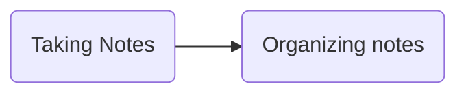

# Getting Started with Obsidian
```toc
```
*The links to plugins in this page aren't broken. This document is designed to be read from within an Obsidian Client.*
Obsidian is a pretty stellar note-taking application. It's supports pretty much every Markdown feature you might expect, is free-to-use, heavily customizable and extensible with an active contributor community, and lives on the user local file system.

Obsidian does a lot of things right. A flexible Markdown application can be pretty handy, but a bit overwhelming to learn to use, much less set up, especially when that means combing through and setting up dozens or even hundreds of plugins. I've been an Obsidian user for about a year, and have heavily customized it (meaning I've installed other people's installed plugins) to suit my own needs for knowledge base building journaling, self-organization, and more. 

This year, I left my job to go full time on building [Uncloak](https://uncloak.org), a community-wiki primarily focusing on making cryptography engineering and zero knowledge cryptography, with an aim to make cryptography accessible for everyone. Obsidian complements this by offering a flexible, extensible substrate for building and hosting our knowledge graph.

To contributors who have been directed at this post: while Uncloak is built with Obsidian, every page is pure Markdown; you don't have to follow this post to contribute. But I want to recommend Obsidian as a tool, for those who would like to use it. This post is aimed at those who are interested in getting started with Obsidian.  We'll go over Obsidian in three parts. 

In **Part One**, we'll set up some sane settings and name a few useful plugins. I've set up a sample Obsidian directory to go along with this post, containing most of the setup choices I describe here. You may [clone it](https://github.com/thor314/obsidian-setup) to try it out. If you'd like to steal some or all of the settings, copy the `.obsidian*` folder. If you don't get too bogged down in the recommended community plugins, Part One serves as a reasonable 10-30 minute introduction to setting up Obsidian.

In **Part Two**, we'll talk about how to use Obsidian for a few different workflows: knowledge-basing, journaling, and self-organization; generally, how to best set Obsidian up for your purposes. This section aims to be a guided tour through ways that people use Obsidian, with a guided tour of how you might set Obsidian up for your own uses.

Finally, in **Part Three**, I'll describe every plugin I've looked at in the last year, and how you might use them. I've looked at a lot. In preparation for this post, I looked at a lot more. Trying out and setting up plugins can be time intensive; my goal here is to list what's out there and help you choose what you want, getting through your set-up quicker. If you have plugins you enjoy, feel free to tell me about them. Please don't be offended if you wrote a plugin that I didn't recommend. This post is intentionally opinionated: my opinions may not match yours.

**A note on security**: I weakly claim that none of the community plugins I install or recommend are out to pwn your system, but I could be wrong. If you installed Obsidian unsandboxed, your system is more vulnerable to malicious plugin authors. A way to avoid this is to either:
- Audit every plugin and update yourself. Auditing plugins is time-intensive, but is the only way to be absolutely confident in your system security.
- Prefer only plugins with many downloads, in which case, a malicious or compromised plugin maintainer will only pwn you *and* everyone else.
- Use a sandboxed installation, which prevents Obsidian from poking your system except in very constrained ways, but will prevent plugins like *Obsidian Git* from being able to poke your system for automated git backups.
- Live with risk. This isn't necessarily bad, just know that you might not want to keep anything too valuable on a machine with a larger attack surface.

If you're just getting started with Obsidian, I don't recommend you try reading this post in one sitting. Actually, I don't recommend anyone try to read this 9000 word post in one sitting. You may want to take several passes over each section, while you set up Obsidian the way you like it, and figure out how you want to use the tool. 

For questions, feel free to [message me on Twitter](https://twitter.com/cryptograthor), shoot me an email at thorck a-squiggle pm dot me, or try the [Obsidian User Forum](https://forum.obsidian.md/).

## Part One: Setting up
### Installin Stuff
[Go to the install page](https://obsidian.md/download) or copy the instructions below. As described above, opting for a sandboxed installation is more secure, especially if you use many community plugins.
```sh
# MacOS
# Brew uses the macOS sandbox to install
# https://docs.brew.sh/FAQ#why-does-homebrew-say-sudo-is-bad
brew install --cask obsidian

# Linux; I recommend the snap installation as I'm biased against flatpak for being verbose on the command line, unforgivable
# from my setup script: https://github.com/thor314/.setup/blob/main/install.sh#L189

# Change 1.0.3 to the current version
wget https://github.com/obsidianmd/obsidian-releases/releases/download/v1.0.3/obsidian_1.0.3_amd64.snap
# Run in sandbox (more safe, especially if you're using many extensions)
snap install obsidian_*.snap
# Run outside of sandbox, allow Obsidian to poke your system (less safe)
snap install --dangerous --classic obsidian_*.snap
```

### Getting started
Open the app, and make a directory, as directed by the GUI. Note that you can manipulate files via the terminal as well. Make a new file, and play with the buttons on the left sidebar. The most useful hotkeys are is **Ctrl-P**, bringing up the Command Palette and **Ctrl-,** for settings. 

After a quick walk through some convenient settings options, we'll walk through some workflows to make the most of Obsidian.

 I won't go through every setting, just a few important ones. Where relevant, I will link to community plugins I recommend. On your first read through, I might recommend skipping the plugin links until a second pass, as it's easy to spend an hour rabbitholing on a plugin. I also list all my plugins recommendations and how to set them up at the bottom of this article.

#### Some Sane Defaults
- Editor:
  - spellcheck, overlaps with [LanguageTool](obsidian://show-plugin?id=obsidian-languagetool-plugin), which also checks grammar. I toggle to enable checks when working on a page I intend to publish.
  - 2-space indents, for nicely laid out lists (like this one)
  - vim mode - configurable via the [vimrc](obsidian://show-plugin?id=obsidian-vimrc-support) plugin, which we will return to shortly;
- Files and Links:
  - Move deleted files to Obsidian `.trash` folder instead of deleting, makes for easy recovery
  - Automatically update internal links - Obsidian can track links between files, and update links when you change title names.
  - Default location for new attachments set to *In the folder specified below: `media`*; storing all media in one location is convenient for avoiding clutter in your directories. You may want to exclude your media folder from searches.
- Appearance: About the left and right bars: the bars are often useful, but tend to be in the way when working. I recommend setting a hotkey to toggle them (I've set F3 and F4 here).
  - Minimal is a popular theme with a [plugin to tweak](obsidian://show-plugin?id=obsidian-minimal-settings) elements of the appearance, like coloring headers differently. I find that the Atom and Catpuccin theme tweaks in the prior plugin make Obsidian feel warmer. [Hider](https://obsidian.md/plugins?id=obsidian-hider) is also useful for hiding unwanted UI elements.
  - The native fonts are good, but I like custom fonts. I use [Fira Code](https://github.com/tonsky/FiraCode) for a monospace font, and I use [Karla](https://fonts.google.com/specimen/Karla) and [Atkinson](https://brailleinstitute.org/freefont) for system and text fonts. If you want to font-dive, check out [nerdfonts](https://www.nerdfonts.com/). You may have to log out and log back in before Obsidian recognizes your fonts.[^1]
- Hotkeys - There's a lot to unpack here, but the default keybinds are basically okay. You can look at [hotkey plugins](https://obsidian.md/plugins?search=hotkeys) if you'd like; [Hotkeys++](obsidian://show-plugin?id=hotkeysplus-obsidian) is quite good. I'm a fan of [Chorded keys](obsidian://show-plugin?id=leader-hotkeys-obsidian) for grouping related keybinds, which helps with remembering where I bound a key.

#### Core Plugins
  We'll run through the plugins Obsidian ships with. Some are good, others are outclassed by existing community plugins.
  - Audio recorder - Record audio and save in a note; I don't use this.
  - Backlinks - Show what other notes link to this note; great for knowledge-graphing
  - Command Palette - Good. 
  - Daily Notes - If you intend to journal but not do weekly/monthly/quarterly/yearly notes, Daily notes is good enough. If you do want to do those things, use [Periodic Notes](obsidian://show-plugin?id=periodic-notes) instead.
  - File Explorer - I've gone back and forth between this and [File Tree](obsidian://show-plugin?id=file-tree-alternative). File Tree is more compact and less finicky; I tend to like File Tree more, but both are good.
  - File recovery - Great file backup, takes snapshots of the vault every N minutes.
  - Format converter - for migrating from another app.
  - Graph View - If using Obsidian for knowledge-basing, Graph view is great! There are many adjacent plugins, we'll get to those in part 3.
  - Note composer - I would rather just copy paste than have hotkeys to break notes into parts. There's a popular community plugin to power this feature up called [Note Refactor](obsidian://show-plugin?id=note-refactor-obsidian), but I don't use it.
  - Outgoing links - Show the outgoing links from the open file in the right sidebar. I don't use it often. 
  - Outline - See the outline of a long note in the right sidebar, seldom used
  - Page preview - Hover a link to see the first few lines, wikipedia style. Great feature.
  - Publish - Premium feature, a bit pricey, but great if you'd like to work on a [public knowledge graph to share with your community](https://uncloak.org) 
  - Quick Switcher - Outclassed; I use [quick switcher++](obsidian://show-plugin?id=darlal-switcher-plus) to search for notes, subheadings and more.
  - Random note - never used
  - Search - Good. Search through your vault for stuff. [Omnisearch](obsidian://show-plugin?id=omnisearch) is a search power-up.
  - Slash - I prefer to use command palette
  - Slides - Never used, but hypothetically for making presentations from markdown.
  - Starred - Nice in theory, in practice I prefer to set hotkeys with [Hotkeys for specific files](obsidian://show-plugin?id=obsidian-hotkeys-for-specific-files) for my most used files.
  - Sync - Premium feature for $100/year to sync files across devices; there are community plugins if you'd like to avoid the fee and sync via dropbox or git repos. 
  - Tags - Tag files with \#hashtags, as a way to categorize files. Hashtags work with forward slashes for organization, so \#supercategory/category/subcategory creates a nested series of tags. Disabling the tags plugin doesn't disable tags, only the right-sidebar tags interface. Plays nicely with the [Tag Wrangler](obsidian://show-plugin?id=tag-wrangler), which adds tools to manage tags.
  - Templates - Create notes from templates. [Templater](obsidian://show-plugin?id=templater-obsidian) is the powered up version of Templates.
  - Unique note creator - Create random hashes for note prefixes. Never used.
  - Word count - Show the word count at the bottom, nice to have. [Better word count](obsidian://show-plugin?id=better-word-count) eclipses by updating the word count when you select a section of text.
  - Workspaces - Open a specific set of pages. Useful for systemically returning to a set of notes. [Workspaces Plus](obsidian://show-plugin?id=workspaces-plus) enhances the workspace workflow.

## Part Two: Workflows
So hopefully that quick run through settings-land wasn't too excruciatingly dull; we're going to switch gears into some ways you might like to use the app. As it goes with productivity tools and cults, some things are straightforward, others are not--the jutting darkly faceted tablet emerging from yonder void probably means nothing, must mean nothing, and must never be spoken of.

Carrying on, we're going to focus on some common workflows for the app. If you haven't yet, play around with the Obsidian interface for a little while before diving into workflows.
We'll focus on outfitting Obsidian for three workflows:
- Knowledge base-ing
- Journaling
- Self organization

### Based Knowledge is Based
The basic premise of choosing to use a graph-based knowledge base is that the connections that arise from the graph context can be quite useful. Obsidian doesn't force you to use the tool in any one way, but a particularly good way is based on the [Zettelkasten](https://en.wikipedia.org/wiki/Zettelkasten) approach. There's now an abundance of zettelkasten guides; they basically all boil down to a few key points:
- Set up your knowledge base like a gardener: the reward of doing the whole knowledge base thing is that you get to spend your time wandering around it. Take notes however feels rewarding, but the reason we use a graph at all is to make the connections between concepts clear.
- Develop your own system for how you want to organize and categorize notes. I'll recommend a system below, but developing a sense for the *types* of ideas can be quite powerful in itself. Tags (\#these_things) are my preferred way to categorize types of ideas.
- When describing concepts, shorter notes that state *exactly the point*, are better suited for the graph garden than long-winding notes. Short notes describing single concepts make clearer connections.
- When exploring a new idea, it may be worthwhile to have a staging area for taking notes (eg. when reading a book), and a graphing area for moving finished staged notes into. This takes time, and may not be worthwhile for topics you don't much care about.

I've wandered around the Zettelkasten productivity thought leadership; my recommendation is not to bother. Knowledge can be complicated, but the system is simple. Invest a little extra time in note-organizing, for the reward of a contextually clear knowledge graph. The graph encourages you to develop thoughts about how your ideas fit together, and reveals connections you may not have made otherwise. Shorter notes make for more elegant node elements. This may be obvious, but it's fine to take notes on something and not move them into the graph: don't spend your time working on graph elements you don't care about. 

Some other recommendations:
- Make a top-level directory for each use case you intend to use Obsidian for. In this case, I recommend one for note-taking, and one for knowledge-graphing.
  - Within the note-taking directory, I recommend one further level of subdirectories dividing notes by source material: books, papers, blog posts, podcasts, etc. Why group by source material rather than topic material? Because \#tags are better suited for grouping notes by topic than directories. The tools for working with tags are more flexible than for working with the underlying filesystem. You can tag a single note with multiple topics, for instance. Dividing content by source also makes it easier to keep fewer, better organized templates. 
  - For your graph directory, you may want to avoid any further subdirectories. Instead, use the graph view to navigate connections between notes. If your graph elements are highly structured with clear parent-sibling-children relationships, consider using the [Breadcrumbs](obsidian://show-plugin?id=breadcrumbs) plugin to indicate relationships between nodes instead of, or in addition to, nested subdirectories in your graph area.
- The game of "doing graph well" tends to involve answering the question: how do I use templates, tags, and YAML metadata[^4] to make life easy? There's a list of [[#Knowledge Basing Plugins]] that you may find useful in the following plugins section. 
- If you're the kind of person who keeps a billion tabs open, consider making short notes on each page that you find interesting. You can then search through your notes with Obsidian's search features. I recommend creating one note per link, and adding an internal link to each new note from a topic reference note. You can automate the append-to-reference-note step via a QuickAdd macro, though these are somewhat time consuming to set-up and test out. I've set up an example of this flow for this vault, see QuickAdd settings. Copy some web link, and try out calling my custom macro `QuickAdd: create web note and add to sample web reference`. The macro creates a note in `note/web`, and an entry in [[r-Sample Web Reference]]. Templater and QuickAdd take a little time to learn, but are two of my most used plugins.
- If you want different settings for different directories, use separate Obsidian Vaults. Symlink the plugins and settings that you want to keep synced across vaults.

### Writing n Journaling
A neat thing about having Obsidian open all day for note taking and whatever, is that I'm much more likely to journal. I think of my Obsidian journal as my daily staging area for my daily thoughts and tasks. I use the [Quickadd](obsidian://show-plugin?id=quickadd) plugin to log journal entries, without leaving the active working note.
![[Pasted image 20221109130405.png]]
*a journal capture from within my journal directory, though the method could have been called from elsewhere in my vault*

The default Daily Note plugin is all you need to get started journaling, but if you'd like to also write regular reviews (options for weekly, monthly, quarterly, yearly), you should look instead at [Periodic Notes](obsidian://show-plugin?id=periodic-notes), which is reasonably straightforward to set up, and works just how you'd expect.

Another advantage of keeping a daily journal is that you can use it for lightweight daily todo management. I want my personal task management system to:
- clarify what needs to be prioritized on any given day, including recurring tasks
- be updateable from mobile and desktop
- remain flexible and low-fuss

In my daily journal, I keep an active list of 2-10 tasks that I want to accomplish in the next several days. Having the tasks in front of me helps me choose what to prioritize. Unchecked boxes are automatically rolled over to the next day's journal by the [Rollover Daily Todos](obsidian://show-plugin?id=obsidian-rollover-daily-todos) plugin. If the task list gets too long, I bump the backlog tasks out to a backlog note (low fuss) or a todo app (higher fuss).

I used the [Tasks](obsidian://show-plugin?id=obsidian-tasks-plugin) plugin for awhile, for scheduling recurring tasks, which was alright. The user makes some tasks with scheduled due dates and/or recurrence cadences in text, eg:
- [ ] #task groceries ⏫ 🔁 every week on Saturday ⏳ 2022-11-11 📅 2022-11-12

Tasks can be included in the daily todo by putitng a dynamic block in the journal template:
```tasks
not done
short mode
scheduled before tomorrow
limit to 5
```

But for a better mobile experience, I've lately switched to using Todoist for scheduling recurring tasks, and sometimes backlog tasks. The workflow is largely the same: write recurring tasks in the app, include a codeblock in the journal template to display tasks scheduled for the day. The [Todoist Sync](obsidian://show-plugin?id=todoist-sync-plugin) plugin allows me to create Todoist tasks from within Obsidian, and display tasks from Todoist in my daily journal. 
```todoist
{
"name": "Todoist tasks",
"filter": "today | overdue "
}
```

You may also want to want to interact with and display information from your Google Calendar in your daily journal. There's a [plugin](obsidian://show-plugin?id=google-calendar) for that as well, but it took a half hour of fiddling with the Google Calendar Cloud Platform to set up. Being able to display the day's google calendar to remind me of any upcoming meetings is very nice. You can also use the plugin to set up notes for events in your calendar. The following code block lives in my journal template:
```gEvent
date: {{date}}
type: day
```

You may find that journaling and writing in general becomes much easier and more fun when your notes app makes it easy and pleasant to journal.

### Self organization
You probably already have some idea about how you like to do self organization. This section is in some ways, a repeat of prior sections. The tools and recommendations are largely constant, and this part is really just an excuse for me to ramble about some workflows that might be useful for you.

a-people.md  a-todos.md  advice  ideas  meme  people  project  quotes  system  thor


## Part Three: All the plugins
There's no turning back. You made it 4000+ words into a post about a notes app. You've committed to the lifestyle. The purple monolith is your friend. The purple monolith wants to make you happy. You want to make the purple monolith happy. You want to extend the purple monolith with nice plugins, and you don't want to waste all week doing it. Here's my notes on some nice plugins, and how to fix some user-experience paper cuts.

The following plugin list documents the list of plugins I'm using or trying, or have noped out of. The goal here to help you figure out what plugins you might like to install, and how to get off the ground with Obsidian with less setup cost[^3].

There's no section for "self-organization", since most plugins that fit the description are just generally useful. Use the following links to jump ahead if you'd like.
- [[#General low setup|General low setup]]
- [[#General medium setup|General medium setup]]
- [[#General high setup|General high setup]]
- [[#Knowledge Basing Plugins|Knowledge Basing Plugins]]
- [[#Journaling Plugins|Journaling Plugins]]
- [[#Plugins I should mention but don't use|Plugins I should mention but don't use]]

These notes are opinionated, your mileage may vary, blah blah not financial advice, all the disclaimers.

### General low setup
Plugins that just work, with 5 minutes of setup or less:
- [Advanced New File](obsidian://show-plugin?id=obsidian-advanced-new-file) - Create new files, prompts for what directory to put the file in, so you don't have to move them manually. I replace the default *new note* Ctrl-N with this. The Advanced New Folder plugin is broken, unfortunately.
- [Advanced Tables](obsidian://show-plugin?id=obsidian-advanced-new-file) - Must have, makes working with Markdown tables easy. I set table hotkeys under a leader key to make them easier to remember, but the setup of the actual plugin is very minimal.
- [Auto Link Title](obsidian://show-plugin?id=obsidian-auto-link-title) - No setup, replace pasting links with their title. Disable for your templates directory.
- [Better word count](obsidian://show-plugin?id=better-word-count) - One feature difference from the default word count (see bottom ribbon): select some text, the wordcount will reflect the words in the selection.
- [Clear Unused Images](obsidian://show-plugin?id=oz-clear-unused-images) - Finds unused images in your media folder and clears them, saving space in your vault.
- [Creases](obsidian://show-plugin?id=creases) - Not a huge improvement, but gives hotkeys for folding by headers, and a custom folding scheme that I don't ever use. I bind the default toggle-fold to Alt-H, and some of the toggle-fold for H1-6 to leader-keys.
- [Filename Heading Sync](obsidian://show-plugin?id=obsidian-filename-heading-sync) - H1 headers should usually match filenames. This plugin enforces it. Typically worth disabling for templates, which may have templates in their H1.
- [Footnote Shortcut](obsidian://show-plugin?id=obsidian-footnotes) - 1 new hotkey for creating, jumping to, and jumping back from footnotes, which I bind to Alt-F. I tried [Better Footnote](obsidian://show-plugin?id=better-fn), but found its model of footnotes less convenient.
- [File Tree Alternative](obsidian://show-plugin?id=file-tree-alternative) - alternative to the default file-explorer. Shows files in a more compact way, with note counts. Doesn't require much setup; you will know quickly whether you like or hate the UI.
- [Hider](obsidian://show-plugin?id=obsidian-hider) - Hide UI elements you don't like. I hide the app ribbon (don't do this unless you're totally comfortable with the keyboard commands!) and the scrollbar.
- [Hotkey Helper](obsidian://show-plugin?id=hotkey-helper) - Tools for managing and viewing plugin hotkeys.
- [Hotkeys++](obsidian://show-plugin?id=hotkeysplus-obsidian) - Some overlap with vim mode. I mainly use this to toggle to-do lists and blockquotes. The default keybinds are fine.
- [Key Promoter](obsidian://show-plugin?id=key-promoter) - Help remind you where your hotkeys are, when you use the mouse to click something you could have hotkey'd. I feel it could be better, but it's better than nothing.
- [Natural Language Dates](obsidian://show-plugin?id=nldates-obsidian) - Trigger Obsidian to replace natural language dates with the character @.
- [Multi Column Markdown](obsidian://show-plugin?id=multi-column-markdown) - Sometimes you just need columns. Great for creating space-efficient hub notes: notes that link to many other notes. Doesn't play nice with other dynamically loaded content though.
- [Obsidian Charts](obsidian://show-plugin?id=obsidian-charts) - Create charts. Not a lot of setup, the popup on `Insert New Chart`, and `Create Chart from Table` are pretty self-explanatory. I don't use this too often, but it's a nice feature to have.
- [Omnisearch](obsidian://show-plugin?id=omnisearch) - Powered up fuzzy grepping search across files and vaults. Replaces core search plugin, and in-file search. Bind vault-search to Alt-O, runs slower than find-note search, which doesn't search inside files. For another powered-up search with many settings for filtering, see [Vantage](obsidian://show-plugin?id=vantage-obsidian).
- [Obsidian Pandoc](obsidian://show-plugin?id=obsidian-pandoc) - Tool to export notes to other formats: pdf, html, ePub, docx, Latex, etc. Requires that you have `pandoc` and `pdflatex` CLI tools, which you should be able to install with your package manager of choice. You have to set up the export directory before you can use this plugin.
- [Remember Cursor Position](obsidian://show-plugin?id=remember-cursor-position) - Does what it says on the box: remembers cursor position across files.
- [Scroll Offset](obsidian://show-plugin?id=obsidian-scroll-offset) - Keep some distance between your cursor and the bottom of the screen, I set to 80 px, or about 3 lines. If you click into the buffer space, you break the spacing for the current note.
- [Show Current File Path](obsidian://show-plugin?id=obsidian-show-file-path) - Show the file path in the bottom ribbon in an unobtrusive way.
- [Tag Wrangler](obsidian://show-plugin?id=tag-wrangler) - More tools to manage tags in the core plugin right-sidebar tags pane.

### General medium setup
Plugins that you may want to poke for at least 10 minutes. 
- [Completr](obsidian://show-plugin?id=obsidian-completr) - YAML frontmatter and LaTeX completions. I disable natural language completions, as I find it more often annoying than helpful.
- [Dictionary](obsidian://show-plugin?id=obsidian-dictionary-plugin) - Create a dictionary view in the right sidebar, includes a thesaurus. Bound to Alt-D. Supports several languages.
- [Hotkeys for Specific Files](obsidian://show-plugin?id=obsidian-hotkeys-for-specific-files) - For your notes that you intend to regularly revisit, it may be worth binding hotkeys to them. Works nicely with Leader keys. I prefer this over starring notes. I bind keys for templates that I edit frequently (periodic note templates), personal-organization hub notes, and personal reference notes.
- [LanguageTool Tracker](obsidian://show-plugin?id=obsidian-languagetool-plugin) - Integration with the [LanguageTool](https://languagetool.org/) grammar checker, nice extension for avoiding dumb grammar issues. I prefer this over the default spellchecker, as LanguageTool checks for spelling errors and grammar issues. LanguageTool has a free mode and a premium mode, the free mode is already reasonably decent. There's also a browser extension for LanguageTool, if you're into that.
- [MetaEdit](obsidian://show-plugin?id=metaedit) - Edit the YAML metadata with a customizable modal window. Can be used to name YAML tags and enumerate their values, with a little set-up. Currently using this, would like to eventually try the [Metadata Menu](obsidian://show-plugin?id=metadata-menu) plugin, which appears to have similar goals and a few more options.
- [Minimal Theme Settings](obsidian://show-plugin?id=obsidian-minimal-settings) - Set up Obsidian to look the way you want to. I use the Atom custom theming, enable focus mode, change headers to be of different colors, and disable image maximization.
- [Obsidian Git](obsidian://show-plugin?id=obsidian-git) - Back up your personal vault to a remote git repository every N minutes. I've stopped using this in favor of the premium Sync, but it is well done. It may not work with sandboxed Obsidian clients.
- [Quick Switcher++](obsidian://show-plugin?id=darlal-switcher-plus) - Replaces the Quick Switcher default plugin. The default command palette shows key-bindings, so the default is still preferred there. I bind Ctrl-S to `Symbol Mode` and Ctrl-L to `Related Items Mode`, and Ctrl-H to `Headers Mode`, and move `Search Replace` to Ctrl-R.
- Sliding Panes (Andy Matuschak Mode) - Deprecated, but I want to highlight the `Toggle Stacked Tabs` command, which does the same. If you use many tabs, stacked tabs is an interesting UI; I'm still figuring out whether I like it. Documentation: [Stacked tabs - Obsidian Help](https://help.obsidian.md/User+interface/Stacked+tabs).. If you do like stacked tabs, try out Pane Relief, for more hotkeys for navigating tabs and panes and Cycle through Panes.
- [Smarter Markdown Hotkeys](obsidian://show-plugin?id=obsidian-smarter-md-hotkeys) - Hotkeys to replace many toggle commands in Obsidian. Smarter Markdown Hotkeys assumes that if your cursor is on a word or part of a word, you mean to bold/italic/whatever the whole word, not put asterisks in the mi\*\*\*\*dle of the word like this. I bind many of these, replacing defaults where possible.
- [Workspaces Plus](obsidian://show-plugin?id=workspaces-plus) - enhances the default Workspaces plugin with useful UI elements and hotkeys. Workspaces are a good candidate for leader keys.

### General high setup
Some plugins take longer to set up, but enable entirely new Obsidian workflows. Each of these may take at least a half hour to set up and get acquainted with. If you have time for just two, familiarize yourself with just 2, learn to use Templater and QuickAdd. Vimrc too, if you're using Vim mode.
- [Dataview](obsidian://show-plugin?id=dataview) - A JavaScript API and SQL-like query language for filtering, sorting, and extracting data from your vault. May heavily influence how you use notes' YAML metadata. Suggested use case: you've used Obsidian for a while, and want to analyze metadata about your vault. If you're using this, you may also want to look at [MetaEdit](obsidian://show-plugin?id=metaedit), for managing note metadata. I don't currently use this.
- [Linter](obsidian://show-plugin?id=obsidian-linter) - Highly flexible tool for correcting common formatting issues. The tool is very conservative by default, but has many options to enable, as well as an option to define custom rules.
- [QuickAdd](obsidian://show-plugin?id=quickadd) - Powerful way to add content to the vault, but can be very fiddly to set up. QA comes with 4 modes, of which I use 3.
  - [Capture](https://github.com/chhoumann/quickadd/blob/master/docs/Choices/CaptureChoice.md) - Pop up a prompt to append some text to a file, creating it (from a template if you'd like) if the file doesn't exist. In this example repo, I've set up a pair of example captures to append entries and todos to your journal file. You may have to reload Obsidian before your Captures work. See the accepted template syntax [here](https://github.com/chhoumann/quickadd/blob/master/docs/FormatSyntax.md). You can include Templater replacements inside your QA Captures.
  - [Template](https://github.com/chhoumann/quickadd/blob/master/docs/Choices/TemplateChoice.md) - Create files from templates. Capture also allows you to create files from templates, but Template allows you to choose where the file will be created from a dynamic list of directories, which is often a very useful feature. This vault includes an example of using a QA template to create a new reference note in `note/reference` , though I could have equivalently set the Templater default template for the `reference` directory, and used `Advanced new file: create new note` to choose the reference directory, since every note in the reference directory is presumably a reference note[^5].
  - [Macro](https://github.com/chhoumann/quickadd/blob/master/docs/Choices/MacroChoice.md) - Combine calling other commands. Very useful for simultaneously adding content in multiple locations. I've set up a demo macro for creating a note on a web page, and adding a link to the new note into a web-page reference note. Macros can also call custom JS scripts, if you feel comfortable with that.
  - [Multi-choice](https://github.com/chhoumann/quickadd/blob/master/docs/Choices/MultiChoice.md) - if you write many QA's, but don't want to bind them each to a key, but instead choose from a dropdown menu of QA's, multichoice allows you to organize them into a list.
- [Templater](obsidian://show-plugin?id=templater-obsidian) - More powerful tools for templating files and creating files from templates than the default Template plugin offers. If you're comfortable writing JS scripts, you may embed [your own scripts](https://silentvoid13.github.io/Templater/user-functions/script-user-functions.html) within templates. [Docs](https://silentvoid13.github.io/Templater/). The tool has an active [discussion forum](https://github.com/SilentVoid13/Templater/discussions). See the templates directory for some templater examples.
- [Tracker](obsidian://show-plugin?id=obsidian-tracker) - similar to Dataview, but with a more constrained use case: collecting statistics about your vault. [Some examples](https://github.com/pyrochlore/obsidian-tracker/blob/master/docs/Examples.md). Also see [Vault Statistics](obsidian://show-plugin?id=obsidian-vault-statistics-plugin). I don't currently use either.
- [Vimrc Support](obsidian://show-plugin?id=obsidian-vimrc-support) - If you use Vim mode, you probably want this. See the `.obsidian.vimrc` file for a sample setup, and the [home page](https://github.com/esm7/obsidian-vimrc-support) for info. You'll probably want to enable yank-to-system-clipboard and a couple other things. If you use vim in Obsidian, you can't actually copy text without unbinding Ctrl-C, or using vim yank-to-system-keyboard.

### Knowledge Basing Plugins
There are many community plugins that you might be interested in for your knowledge base workflow. I wouldn't recommend trying to learn to use them all at once. Start with Breadcrumbs and Completr; most of these are only useful once you actually have a graph. If you use LaTeX, Jupyter, Pocket, Readwise, or Zotero, there are some decent integration options. 

#### General
- [Obsidian Jupyter](obsidian://show-plugin?id=obsidian-jupyter) - Turn obsidian into an interactive python repl. I haven't used this much but I'd like to.
- [Table of Contents](obsidian://show-plugin?id=obsidian-plugin-toc) versus [Dynamic Table of Contents](obsidian://show-plugin?id=obsidian-dynamic-toc) - If you want a plaintext Table of Contents inserter, go for the former. If you'd prefer your ToC to update dynamically render with file contents (can't copy the contents of the rendered table), there's the latter. The former is buggier, and may misnumber the contents, but are easy to replace with bullet points. 

#### Graph Tools
- [Breadcrumbs](obsidian://show-plugin?id=breadcrumbs) - Set up structured relationships (parent, child, sibling) between notes. [Docs](https://breadcrumbs-wiki.onrender.com/docs/Home). Your graph links are unstructured, but you can use this plugin to add some structure back in. Provides its own tabular view of relationships, also integrates with Juggl for a graph view. Usage is simple: label relations between nodes in the YAML metadata. Comes with many hotkeys, good to bind with a leader key.
- [Find unlinked files](obsidian://show-plugin?id=find-unlinked-files) - Utility to find unlinked files. Particularly useful if your graph is large.
- [Graph Analysis](obsidian://show-plugin?id=graph-analysis) - Get statistics about the closeness of any two notes, and some other neat graph math. I'm still learning to use this, Journey is simpler.
- [Hover Editor](obsidian://show-plugin?id=obsidian-hover-editor) - Open pages and images in an enhanced Page Preview view pop-up. Also functions as a sort of second overlay of tabs. A key feature is the Juggl integration, for hover-over views of notes in the Juggl alternate graph. Good candidate for leader keys. [[README]]
- [Journey](obsidian://show-plugin?id=obsidian-journey-plugin) - Tools for finding paths between two notes in your knowledge base. Makes an unfortunate interface choice, the plugin should include a function, but only has a clicky button in the left bar. 
- [Juggl](obsidian://show-plugin?id=juggl) - An alternative to the Obsidian native graph view, integrating with Breadcrumbs for a structured view of note-relationships, and Hover for hover-over previews of nodes in the graph. Doesn't do well with vaults with more than 250 notes (which isn't many). [Docs](https://juggl.io/Juggl). I'm currently trying this out. An alternative to Juggl is ExcaliBrain.
- [ExcaliBrain](obsidian://show-plugin?id=excalibrain) - An alternative to Breadcrumbs and Juggl for structured graph content, with a different UI. I'm currently trying this out, weighing it against Juggl. Requires DataView and Excalidraw to be installed as well.

#### Specifically if you work with LaTeX
- [Completr](obsidian://show-plugin?id=obsidian-completr) (repeated from general medium setup) - YAML frontmatter and LaTeX completions. I disable natural language completions, as I find it more often annoying than helpful.
- [Quick Latex for Obsidian](obsidian://show-plugin?id=quick-latex) - Some nice quality of life automation for writing Latex. Most involve pressing space after some short command to expand to a longer unwieldy command.
- [Copy as Latex](obsidian://show-plugin?id=copy-as-latex) - Copy markdown as LaTeX. Very useful if you move between the two formats. Overlaps Pandoc, but with the feature export selections as opposed to whole files.
- [Obsidian Pandoc](obsidian://show-plugin?id=obsidian-pandoc) (repeated from general low setup) - Tool to export notes to other formats: pdf, html, ePub, docx, Latex, etc. Requires that you have `pandoc` and `pdflatex` CLI tools, which you should be able to install with your package manager of choice.
- [TikZJax](obsidian://show-plugin?id=obsidian-tikzjax): Enable MathJax support for working with TikZ diagrams. If you work with cryptography, take a look at [this library of diagrams](https://www.iacr.org/authors/tikz/).

Good but overshadowed:
- [Latex Suite](obsidian://show-plugin?id=obsidian-latex-suite) - Snippets for latex. I prefer Completr's interface for completions, and this command duplicates some of Quick Latex's snippets.
- [Latex Environments](obsidian://show-plugin?id=obsidian-latex-environments) - Completr does this, but with a better drop-down menu.

#### I don't use these, but they deserve to be mentioned in this section:
- [Excalidraw](obsidian://show-plugin?id=obsidian-excalidraw-plugin)\* - Integrate a feature-rich drawing tool into Obsidian. I typically would rather use Obsidian for Markdown, and other applications for drawing, and maybe throw a screenshot into Obsidian if I felt inspired. Suggested use case: you want to doodle along-side your notes or knowledge base.
- [Ozan's Image in Editor](obsidian://show-plugin?id=oz-image-plugin)\* - Tools to view images, iframes, PDF Files, excalidraw drawings and transclusions in the Editor view. Suggested use case: for those who like non-text embedded content more than I do.
- [Kindle Highlights](obsidian://show-plugin?id=obsidian-kindle-plugin) - Imports your kindle highlights.
- [Readwise Official](obsidian://show-plugin?id=readwise-official) - Import your highlights from kindle, web highlights, and some other places. I'm looking into trying this and Zotero out.
- [Citations](obsidian://show-plugin?id=obsidian-citation-plugin) (Zotero), [Zotero Integration](obsidian://show-plugin?id=obsidian-zotero-desktop-connector) - Zotero is an "easy-to-use tool to help you collect, organize, annotate, cite, and share research." Import your highlights from a personal Zotero database. 

### Journaling Plugins
- [Periodic Notes](obsidian://show-plugin?id=periodic-notes) - Good for regular journaling, with good integration with Templates and Templater. I recommend keeping a top-level directory for periodic notes.
- [Rollover Daily Todos](obsidian://show-plugin?id=obsidian-rollover-daily-todos) - Quality of life tool for a lightweight todo workflow in your daily note. Make checkboxes in your journal file in the checkbox area, this plugin automatically rolls unfinished todos over to tomorrow's journal.
- [Google Calendar](obsidian://show-plugin?id=google-calendar) - Poke your google calendar, from Obsidian. May be useful for taking notes for specific meetings, updating your calendar from Obsidian, displaying your calendar from within a journal files, at the cost of losing at least a half hour to the angry god that is the Google Cloud Platform.
- [Tasks](obsidian://show-plugin?id=obsidian-tasks-plugin) - I found managing todos through Obsidian is fiddly and has a poor mobile experience, so I've recently migrated to using Todoist and Todoist Sync plugin, which I've enjoyed more. I found setting up todos through Tasks too fiddly to be worthwhile for anything except recurring tasks. When I was using Tasks, I set my journal template to include a recurring task area, which was reasonably useful, see the Journal section in part 2 for details.
- [Todoist Sync](obsidian://show-plugin?id=todoist-sync-plugin)- If you're going to do todo's I feel you might as well use an app meant for todos, or else spend a lot of time fiddling with janky scripts for your vault. Todoist comes well recommended, and with a community Obsidian integration. [Todoist Text](obsidian://show-plugin?id=todoist-text) - A lighter version of the same with a non-dynamic text interface. If you already have a todo-manager, there's a decent chance there's a plugin for it.

### Plugins I should mention but don't use
A quick run through some of the more popular plugins (>50k downloads) that I don't use. I also include several plugins that I've tried that didn't work out.
- Kanban - I don't like Kanban boards, but you may differ. You may get some mileage out of this if you use Obsidian for a task manager, but I'm biased against Obsidian for anything but lightweight task-management.
- Calendar - Some people like UI candy like this, I tend to regard it as clutter.
- Outliner - Vim mode + normal lists does everything this plugin does, and doesn't require me to remember a bunch of custom commands.
- Advanced Slides - Some people make markdown decks, which is neat, but I prefer to [draw my slides](https://drive.google.com/file/d/1ejnOVwu6JPaUl72jiDGglndYFIIT0Rdh/view?usp=sharing) when I give talks.
- Admonition - I find these UI pieces overbearingly large, even for their intended purpose of highlighting **emphasis points**, which I find **bolding text** works just fine for, and is universally supported across formats.
- Mind Map - More UI candy, I prefer a normal table of contents to a mindmap.
- Checklist - see Tasks 2 bullets up
- Editor Syntax Highlight - Doesn't change Shell or Rust syntax highlighting, so I uninstalled it. Not sure what languages it does affect.
- Day Planner - UI candy. I would only schedule meetings, scheduling my day like the app seems to me a fiddly act in optimistic futility
- Emoji toolbar - I use an operating system-wide emoji selector; if you don't have one, this might be useful.
- Copy Button for Code blocks - Deprecated; this exists as a default feature
- Annotator - I don't annotate pdfs or epubs from obsidian, but if I did, I might use this
- Note Refactor - An upgrade to default Note Composer, but I would typically rather just copy/cut-paste for breaking notes up.
- Recent Files - UI candy, but not as bad as some of the others. Still, I wouldn't use this much.
- Obsidian Icon Folder - Icon UI candy, not for me
- Advanced Obsidian URI - I'm not actually sure how I would use this, but it seems likely too fiddly for me.
- Remotely Save - I pay the annual $100 for Obsidian Sync, but this looks like a great way to get around it.
- Buttons - I am keyboard people, and do not like ze buttons.
- Highlightr - I don't read PDFs from Obsidian, but if I did, I might use this.
- Spaced Repetition - I do flashcard, but not with Obsidian.
- Markdown prettier - Deprecated for Linter
- Pane Relief - More hotkeys for navigating tabs and panes. I haven't gotten around to trying it, looks good though. Same deal with Cycle Through Panes.
- Cycle through Panes - see Pane Relief.
- Diagrams - draw.io diagrams in Obsidian; poor interface decisions though. Doesn't create any callable commands, and doesn't play nicely with File Tree.
- Text Snippets - Okay, but poor ergonomics for a text-snippets plugin; I prefer to use a system-wide text replacer instead
- Macros - Not particularly effective for the typical Obsidian workflow, use Vim macros if you need them.
- Open Link With - An issue with clicking links in Obsidian is that it doesn't use your already open browser windows. I'd hoped this plugin would solve this, but it doesn't, unfortunately.
  
[^1]: You can install fonts on Linux with the following:
```sh
# make a font directory to store your custom fonts, symlink it to .local/share
mkdir ~/$YOUR_DOTFILES/fonts
ln -s ~/.local/share/fonts/ ~/$YOUR_DOTFILES/fonts
# Get the font however you like, often comes in a zip.
# Move the font to the new directory.
# Update the font cache:
fc-cache -f -v
# check the font is installed
fc-list | {grep or rg} FONTNAME
```
[^2]:  I do highly recommend getting comfortable with basic Vim keybindings. They're supported just about everywhere, and reduce your risk of winding up with repetitive strain injury from pressing control all the time, which is a real risk if you spend most of your work time poking keyboards.
[^3]:  Keybinding aside: After having poured vastly too much time into poking my keybinds in other apps, I now like to generally keep my keybind setups minimally divergent from the defaults where possible. I remap caps lock to control for convenience. If you're on a small keyboard that combines fn keys with f-keys, I might suggest switching your fn keys to default to f-keys, and use your fn button to enable the special volume/brightness buttons. I like to group similar commands under Leader-key keybind chords, eg. `Ctrl-Space f a`, where `Ctrl-Space` is the "leader key". Eg I group special Advanced Table commands under `Ctrl-Space t`. There are three leader key plugins, and unfortunately they all have minor bugs; the least buggy is [Leader Hotkeys Obsidian](obsidian://show-plugin?id=leader-hotkeys-obsidian). If you don't use vim mode[^2], the Leader Hotkeys plugin isn't buggy at all, but the hotkeys currently [don't work in vim normal-mode](https://github.com/tgrosinger/leader-hotkeys-obsidian/issues/32). Yikes. I think that's getting fixed? You can also use the vimrc to set leader key combinations, but the overhead of declaring `obcommand` for everything is a bit much for me (see the vimrc for an example).
[^4]: YAML metadata is information about the file that can be conveniently generated with templates. Eg, the following codeblock, contains file descriptor stuff that goes at the top of files
```
---
creation date: <% tp.file.creation_date() %>
tags: [topic/example, note/web]
sibling: \[\[Some Note\]\]
parent: \[\[Some Daddy or Mommy Note\]\]
template: [[some-template]]
---
\#another-tag 
Note that the tags in the yaml and in the hashtags play nicely with one another.
```
[^5]:  How to choose between creating a QA Capture, QA Template, QA Macro, `Templater: Create new note from template`, and `Advanced new file: create new note` with a default directory template:
- Templater create new note from template: Least setup, just write the template. Creat a new note from a template, filed at the top level directory. You will have to move the file to it's correct location. 
- Advanced new file and default directory template: A little setup. If every note in a directory uses the same template, the least finicky way to create a file is use the Templater directory default template feature. You will be prompted for a directory location, then a filename.
- QA Template: Some setup and testing. Create a new note from a given template, either in a given directory (less useful) or with a dynamic directory selection (more useful). Allows the user to set a file naming convention.
- QA Capture: As much setup as QA Template. Besides adding new content to other notes, QA capture can also be used to create notes from templates. QA Capture does not have dynamic directory selection, but is as useful as QA template if you already know where the file needs to be created.
- QA Macro: potentially very fiddly. Combine other commands together. Works best with other QA commands, as you can reuse entry values, eg. {{VALUE:filename}}, across commands. See the QA setup for an examlpe macro in this vault.